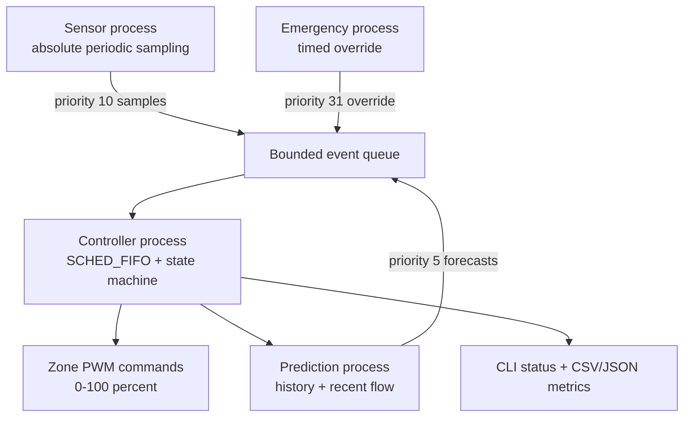

# LumiGrid-RT

Safety-constrained predictive street lighting for QNX on Raspberry Pi 4/5.

LumiGrid-RT coordinates multiple lighting zones from daylight, occupancy,
visibility, and historical traffic patterns. It saves energy during quiet
periods while treating emergency commands and sensor failures as higher-priority
safety events.

> **Hackathon integrity:** This repository is a pre-event learning and validation
> workspace. The event brief requires original code and warns that generated or
> prebuilt submission code may be penalized. Every team member should understand,
> re-create, and be able to explain the modules used in the official submission,
> following mentor and event instructions.

## What is already working

- Four real operating-system processes: sensor, predictor, emergency, controller
- Fixed-size POSIX message queues with priority ordering
- Absolute `CLOCK_MONOTONIC` sensor schedule to prevent timing drift
- Requested `SCHED_FIFO` priorities with a safe fallback on ordinary Linux
- Deterministic LDR, IR, visibility, traffic, emergency, and fault simulation
- Closed-loop two-zone Nano input and QNX-controlled PCA9685 LED PWM
- Explainable prediction from EWMA activity, adjacent-zone activity, and a
  24-hour historical profile
- Safety-first state machine and timed emergency override
- CLI commands for live control and fault injection
- CSV telemetry, event log, JSON metrics, unit tests, and integration tests
- Linux host build now and an ARM64 QNX cross-build target for later

## System architecture



The controller applies this strict precedence:

`EMERGENCY > STARTUP_SAFE > SENSOR_FAILSAFE > DAYLIGHT_OFF > ACTIVE > WEATHER_SAFE > PRELIGHT > PREDICTIVE > ECO`

The priority chain is the central safety guarantee: prediction can increase
lighting demand, but it can never cancel an emergency or lower a fail-safe
brightness.

## Run on a laptop without hardware

Requirements: a POSIX system, GNU Make, a C++17 compiler, and Python 3 for the
integration-test assertion script.

```sh
make
make test
make integration-test
make demo
```

For the mandatory CLI:

```sh
make interactive
```

Then try:

```text
status
occupancy 2 3
emergency on 5
fault 3 on
lux 500
auto
quit
```

On Linux, `RT_FIFO=fallback` is expected unless the process has permission to
select real-time scheduling. The same failure is handled safely and recorded;
do not run the application as root just to hide it.

## Run with the two-zone Nano bridge

The hardware adapter accepts records in the exact format produced by the Nano
sketch:

```text
Z1_LDR=240,Z1_DARK=1,Z1_OBJECT=0,Z1_LED=25,Z2_LDR=700,Z2_DARK=0,Z2_OBJECT=1,Z2_LED=100,EMERGENCY=0
```

On QNX, start the ARM64 binary with `--hardware-stdin`. The option selects two
zones automatically, converts the calibrated day/night flag into a controller
lux proxy, publishes both IR occupancy inputs, and forwards emergency-button
transitions at emergency priority. If records stop, the existing stale-sensor
policy selects `SENSOR_FAILSAFE`.

Upload `arduino/LumiGridNano/LumiGridNano.ino` first. The Windows helper then
opens COM18 and runs a bidirectional bridge: Nano sensor records travel to QNX,
and QNX lines such as `QNX_PWM:Z1=65,Z2=20` return to the Nano and drive the
PCA9685 LEDs. If those commands stop for 2.5 seconds, the Nano automatically
returns to standalone local control.

Run the bridge from the project folder:

```powershell
powershell -ExecutionPolicy Bypass -File .\scripts\bridge_to_qnx.ps1
```

The bridge also starts a dependency-free local dashboard and opens
`http://127.0.0.1:8765/` in the default browser. The dashboard shows live
brightness, target, raw LDR, IR detection, prediction, energy saving, latency,
message count, sensor validity, emergency state, and `RT_FIFO` status. QNX
remains the controller; the browser only displays status emitted by the QNX
process.

Close Arduino Serial Monitor before starting the bridge. Press `Ctrl+C` to stop
the bridge and dashboard. Override `-ComPort`, `-QnxHost`, `-QnxUser`, or
`-DashboardPort` if required. Use `-NoBrowser` to prevent automatic browser
launch, or `-NoDashboard` to run the original terminal-only bridge.

## Build for QNX ARM64

After installing QNX SDP 8.0 and sourcing its environment script:

```sh
make qnx
```

The default compiler variant is `gcc_ntoaarch64le`. If the installed toolchain
uses another variant, override it explicitly:

```sh
make qnx QNX_VARIANT=<variant-reported-by-q++>
```

See [QNX_SETUP.md](docs/QNX_SETUP.md) before attempting deployment.

## Repository map

| Path | Purpose |
| --- | --- |
| `src/main.cpp` | Process creation, queues, CLI, controller runtime |
| `src/control_engine.cpp` | Safety state machine, dimming, energy and latency metrics |
| `src/predictor.cpp` | Explainable historical/recent/neighbor prediction |
| `src/simulator.cpp` | Repeatable hardware-free scenarios and fault injection |
| `src/hardware_input.cpp` | Strict parser for live two-zone Nano records |
| `arduino/LumiGridNano/LumiGridNano.ino` | Two-zone sensor, PWM, emergency, and QNX fallback firmware |
| `config/historical_profile.csv` | Editable hourly traffic priors |
| `tests/unit_tests.cpp` | Deterministic policy and metric tests |
| `scripts/integration_test.sh` | Full multi-process acceptance test |
| `scripts/bridge_to_qnx.ps1` | Bidirectional Windows Nano-to-QNX bridge |
| `dashboard/index.html` | Dependency-free two-zone live dashboard |
| `dashboard/server.py` | Local Python dashboard server and live-state API |
| `docs/` | Architecture, setup, test, hardware, and demo guides |

## Generated evidence

Each run produces:

- `telemetry.csv`: per-zone values and state transitions
- `events.log`: emergency and failure events
- `summary.json`: deadline, latency, energy, and message counts
- `console.log`: captured by the integration test

These files belong in the test report; generated run data is intentionally not
committed.

## Project documents

- [Architecture and QNX concepts](docs/ARCHITECTURE.md)
- [QNX setup and deployment](docs/QNX_SETUP.md)
- [Four-day preparation plan](docs/PREPARATION_PLAN.md)
- [Tuesday hardware integration](docs/HARDWARE_INTEGRATION.md)
- [Test plan](docs/TEST_PLAN.md)
- [Host validation report](docs/TEST_REPORT.md)
- [Live demo script](docs/DEMO_SCRIPT.md)
- [Originality and team-learning checklist](docs/ORIGINALITY_CHECKLIST.md)
- [GitHub publishing checklist](docs/GITHUB_PUBLISHING.md)

## Prepared presentation and report

- [Hackathon presentation](deliverables/LumiGrid-RT_Hackathon_Deck_RELEASE.pptx)
- [Detailed technical report](deliverables/LumiGrid-RT_Technical_Report.pdf)

These contain the verified host baseline. Replace the clearly marked pending
sections with measurements from the exact QNX/Pi/BSP before final submission.

## Reference documentation

- [QNX SDP 8.0 documentation](https://www.qnx.com/developers/docs/8.0/)
- [QNX `clock_nanosleep()`](https://www.qnx.com/developers/docs/8.0/com.qnx.doc.neutrino.lib_ref/topic/c/clock_nanosleep.html)
- [QNX `mqueue` manager](https://www.qnx.com/developers/docs/8.0/com.qnx.doc.neutrino.utilities/topic/m/mqueue.html)
- [QNX `pthread_setschedparam()`](https://www.qnx.com/developers/docs/8.0/com.qnx.doc.neutrino.lib_ref/topic/p/pthread_setschedparam.html)
- [QNX Software Development Platform](https://qnx.software/products/qnx-software-development-platform/)

## License

MIT. See [LICENSE](LICENSE).
