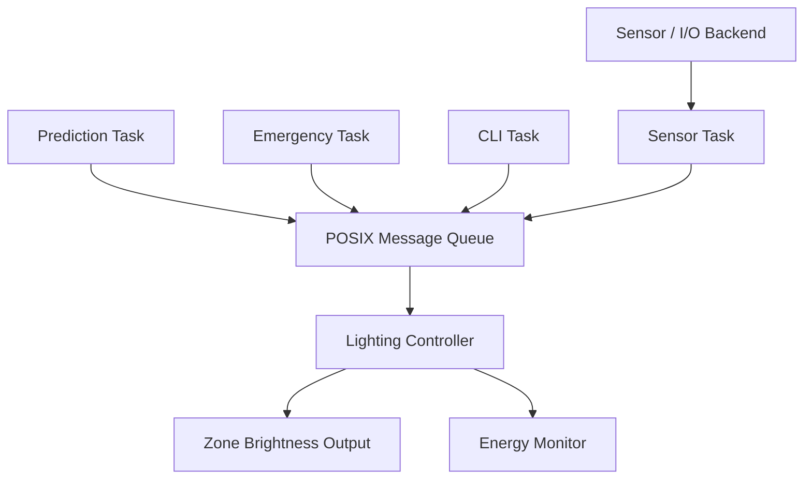

# QNX Smart Street Lighting with Predictive Control

An event-driven smart street-lighting prototype developed using **QNX SDP 8.0** for the **Raspberry Pi 4 Model B**.

The system controls four lighting zones using simulated daylight, motion and sensor-health inputs. It combines current sensor information with historical traffic patterns to choose an appropriate brightness while maintaining emergency and failsafe safety overrides.

## Key Features

- Four independently controlled lighting zones
- QNX POSIX threads with priority-based scheduling
- POSIX message queue for event communication
- Daylight-based automatic switching
- PIR motion detection with a 10-second hold time
- Historical and recent-motion traffic prediction
- Emergency override for all zones
- Sensor-failure failsafe mode
- Manual and automatic control modes
- Energy consumption and savings estimation
- Interactive command-line interface
- Hardware abstraction layer for later GPIO, ADC and PWM integration

## System Architecture



## QNX Task Priorities

| Task | SCHED_FIFO priority | Purpose |
|---|---:|---|
| Emergency Task | 40 | Sends the highest-priority emergency events |
| Lighting Controller | 35 | Processes events and decides light states |
| Sensor Task | 25 | Reads daylight, PIR and sensor-health inputs |
| Prediction Task | 15 | Calculates expected traffic demand |
| CLI Task | 10 | Accepts demonstration and operator commands |

If real-time scheduling permission is unavailable, the application continues using the default thread priority.

## Lighting Decision Priority

The controller applies decisions in this order:

1. **Emergency:** All zones operate at 100% brightness.
2. **Sensor failure:** The affected zone enters 70% failsafe mode.
3. **Manual override:** The requested manual brightness is applied.
4. **Strong daylight:** The zone is switched off.
5. **Live motion:** The zone operates at 100%.
6. **Predicted high traffic:** The zone operates at 50%.
7. **Low traffic:** The zone remains at 20% eco brightness.

## Lighting Modes

| Mode | Description |
|---|---|
| `LIGHT_DAY_OFF` | Light disabled because sufficient daylight is available |
| `LIGHT_ECO` | Minimum energy-saving illumination |
| `LIGHT_PREDICTIVE` | Pre-lighting based on predicted traffic |
| `LIGHT_OCCUPIED` | Full brightness after live PIR detection |
| `LIGHT_MANUAL` | Operator-selected brightness |
| `LIGHT_FAILSAFE` | Safe brightness when a sensor fails |
| `LIGHT_EMERGENCY` | Full brightness across every zone |

## Prediction Method

The prediction engine uses:

- A 24-hour historical traffic profile
- Individual adjustment for each lighting zone
- Recent PIR motion detections
- 70% historical demand weighting
- 30% recent-motion weighting
- Gradual learning from newly observed traffic

Prediction never overrides live motion, sensor-failure protection or emergency control.

## Project Structure

```text
smart_street_lighting/
├── README.md
├── Makefile
└── src/
    ├── smart_street_lighting.c
    ├── app_context.h
    ├── app_tasks.h
    ├── app_tasks.c
    ├── lighting_types.h
    ├── lighting_controller.h
    ├── lighting_controller.c
    ├── event_queue.h
    ├── event_queue.c
    ├── prediction_engine.h
    ├── prediction_engine.c
    ├── io_backend.h
    ├── io_backend.c
    ├── energy_monitor.h
    ├── energy_monitor.c
    ├── cli.h
    └── cli.c
```

## CLI Commands

| Command | Purpose |
|---|---|
| `help` | Display the available commands |
| `status` | Display the zone-state map and energy data |
| `daylight <zone> <0-100>` | Set simulated daylight percentage |
| `motion <zone> on\|off` | Set simulated PIR motion |
| `sensor <zone> ok\|fail` | Simulate sensor health or failure |
| `manual <zone> <0-100>` | Apply manual brightness |
| `auto <zone>` | Return a zone to automatic control |
| `emergency on\|off` | Enable or disable the emergency override |
| `quit` | Stop the application safely |

Zones are numbered from `1` to `4`.

### Example Demonstration

```text
status
daylight 1 85
motion 2 on
sensor 3 fail
manual 4 65
emergency on
status
emergency off
auto 4
quit
```

## Energy Monitoring

Energy usage is estimated from the brightness percentage and elapsed operating time.

The demonstration assumes:

- Four streetlights
- 30 W rated power per light
- An always-on 100% brightness system as the comparison baseline

The `status` command reports:

- Estimated actual energy consumption
- Always-on baseline energy consumption
- Estimated energy-saving percentage

## Development Environment

- QNX Software Development Platform 8.0
- QNX Momentics IDE
- QNX Software Center 2.0.4
- Raspberry Pi BCM2711 R-PI4 BSP, QNX 8.0 Build 484
- Target architecture: `aarch64le`
- Programming language: C

## Building the Application

In QNX Momentics:

1. Select the `smart_street_lighting` project.
2. Select the `aarch64le-debug` configuration.
3. Choose **Project → Clean**.
4. Choose **Build Project**.

Generated executable:

```text
build/aarch64le-debug/smart_street_lighting
```

Current verified build result:

```text
Build Finished. 0 errors, 0 warnings.
```

## Raspberry Pi BSP Integration

The executable is embedded into `images/rpi4.build` using:

```text
/usr/bin/smart_street_lighting=../../smart_street_lighting/build/aarch64le-debug/smart_street_lighting
```

The standard BSP already includes and starts the QNX `mqueue` service.

After rebuilding the Raspberry Pi BSP, copy the generated file:

```text
hw.raspberrypi-bcm2711-rpi4/images/ifs-rpi4.bin
```

to the root of the microSD card’s `bootfs` partition.

## Running on QNX

After the Raspberry Pi finishes booting, run:

```sh
/usr/bin/smart_street_lighting
```

Do not try to run the `aarch64le` executable directly on Windows.

## Planned Hardware

- Raspberry Pi 4 Model B
- 64 GB microSD card
- PIR motion sensors
- LDR daylight sensors
- External ADC for the LDR inputs
- LEDs representing streetlights
- Current-limiting resistors and suitable driver circuitry
- Optional emergency pushbutton
- 5 V Raspberry Pi power supply
- Serial console or supported display and keyboard

The current `io_backend.c` provides simulated I/O. Physical GPIO, ADC and PWM integration will be added after confirming the available laboratory components and pin connections.

## Verification Status

| Verification item | Status |
|---|---|
| Application compilation | Passed |
| Application linking | Passed |
| Compiler warnings | 0 |
| Raspberry Pi BSP build | Passed |
| Application embedded in IFS | Passed |
| Updated IFS copied to microSD | Completed |
| Raspberry Pi boot test | Pending hardware access |
| GPIO/ADC/PWM validation | Pending hardware access |
| Full demonstration testing | Pending hardware access |

## Project Status

The core event-driven software, predictive logic, controller state machine, emergency override, CLI, simulated I/O and energy monitoring are complete. Hardware boot and sensor integration will be performed using the Raspberry Pi 4.